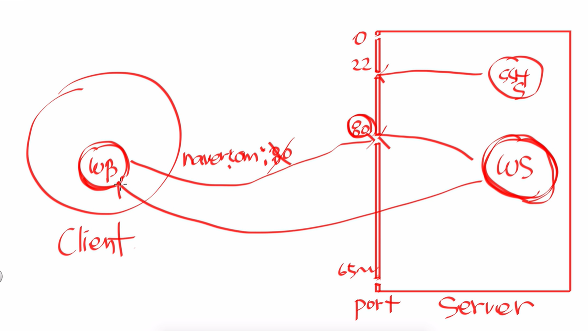

# 폴리텍 광명융합원 정수영

# 발표10 포트포워딩 0428금

# 포트란?

## 정의

컴퓨터에서 프로세스가 통신하기 위해 할당된 번호로, 네트워크에서 특정 서비스에 대한 접근을 가능하게 함. 

### 예시 - 웹서버의 80번 포트

포트는 구멍이라 생각 

웹서버는 기본적으로 80번 포트에서 대기 (80번 포트에 기본적으로 접속하기로 약속) 

1. 클라이언트가 웹브라우저에 서버 주소를 입력
2. 서버컴퓨터로 가는데, 80번 포트로 간다 
3. 80번포트에서 대기 중이던 웹서버가 받고, 동작 후 결과를 클라이언트에게 돌려준다 

# 포트포워딩

## 정의

포트포워딩은 네트워크의 라우터 또는 방화벽에서 외부에서 접근하는 트래픽을 내부의 특정 포트로 전달하는 것. 

외부에서 내부 네트워크에 있는 서비스에 접근할 수 있도록 함. 

### 예시

외부에서 내 집에 있는 노트북에 접근이 불가능하다. 

노트북의 192.168.0.3은 내부의 사설ip니까, 외부에서 접근 불가능 

그러면 내 pc에 서버를 설치하고, 외부에서 접근이 가능하게 하려면? 포트포워딩을 사용해야한다. 

라우터 내에도 포트가 존재한다. (당연히 내pc에 설치한 서버에도 포트가 존재) 

각각의 포트를 사용해서, 특정 포트로 접속이 들어오면 내 pc의 포트로 전달하면 된다 = 포트포워딩 

9000번 포트는 “192.168.0.4의 80번 포트로 가라”로 설정한다. (9000포트는 라우터의 포트)

그러면 라우터가 작동한다 : 9000으로 들어온 신호는 192.168.0.4의 80번 포트로 넘겨버림 

내부에서만 통용되는 공유기의 ip를 default gateway

cmd에서 ipconfig를 쳐서 확인할 수 있다.